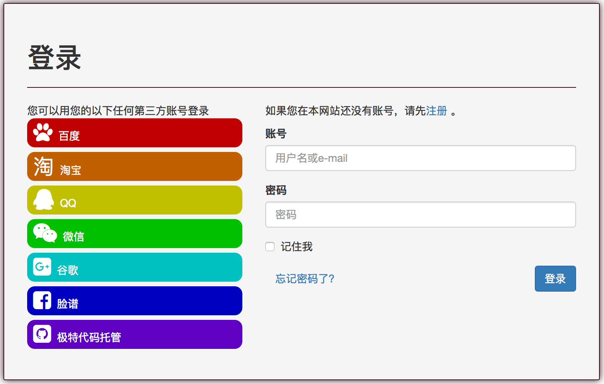
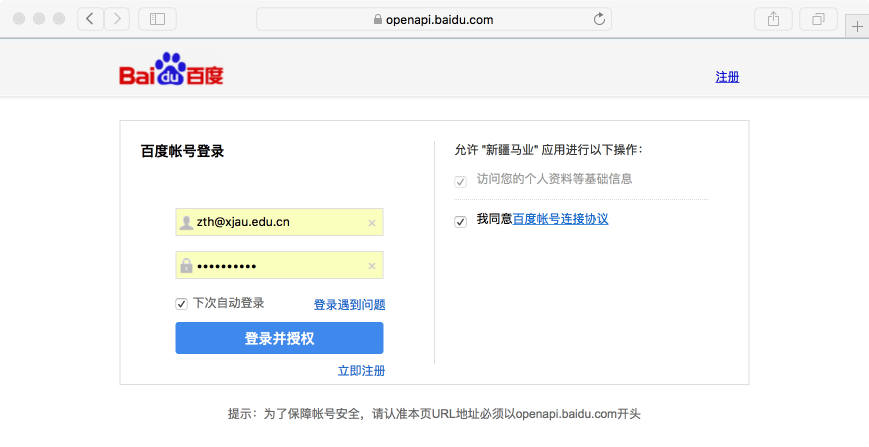
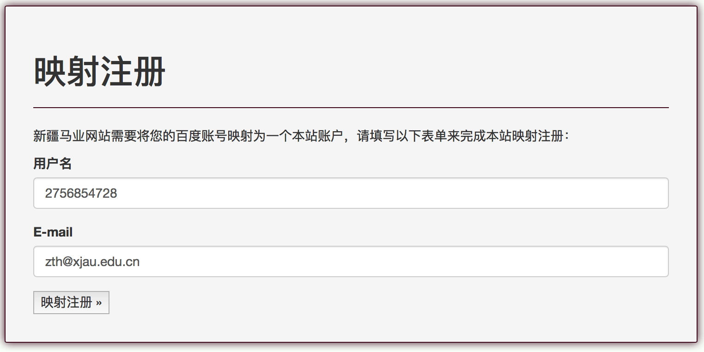
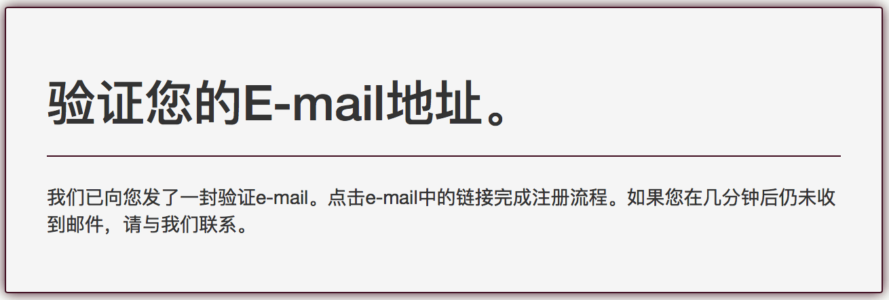
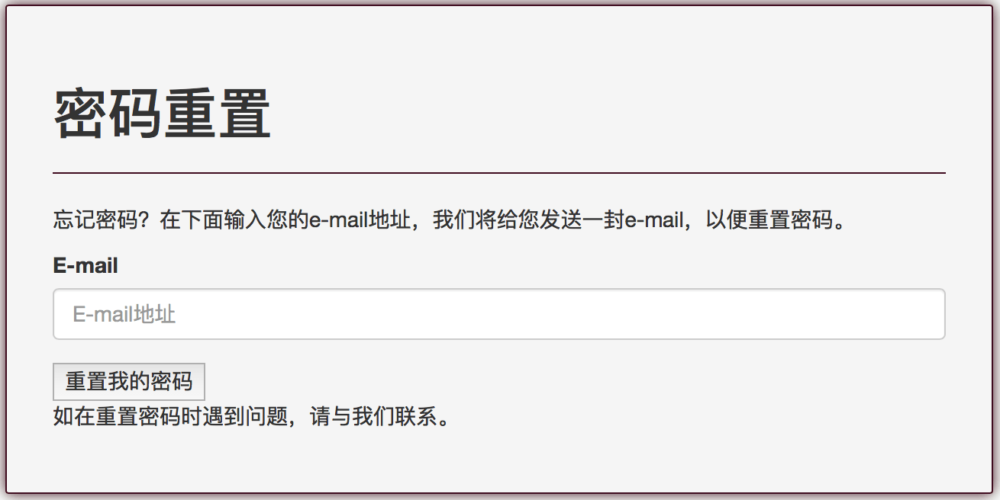
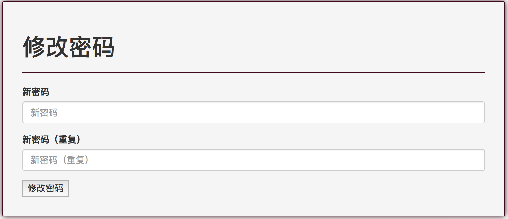

# 新疆马产业科技创新平台《操作手册》
### 一、账户管理
新疆马产业科技创新平台采用统一身份认证、单点登录管理系统所有用户。平台中不受限制的内容不需要登录即可访问，但有些内容的访问、业务操作则要求注册用户获得相应授权后才能进行。
#### 1、用户注册
要在本平台注册一个账号，您必须提供【用户名】和【邮箱地址】，【用户名】不能少于3个英文半角字符、不能多于150个英文半角字符，允许使用英文和中文。【邮箱地址】必须是真实可访问的。平台内【用户名】和【邮箱地址】匀要求唯一性，否则在注册过程中系统将提示"已存在一位使用该名字的用户"或"此e-mail地址已被其他用户注册"。密码不能少于8个字符，且不能全部为数字。
新注册用户会收到一封确认邮件，您必须查收该邮件并点击确认链接进行邮箱确认，只有邮箱确认的账户才能登陆本平台。

要注册一个账户，请在平台首页导航栏点击【登录】，然后选择右上角的【注册】，就会出现下面所示的注册界面：

#### 2、账户绑定
很多人已经在各类网络社交等平台，比如百度、QQ、微信、淘宝上拥有自己的账户，为了减轻用户记忆各类账户和密码的负担，新疆马产业科技创新平台允许通过第三方社交网络认证登录，目前支持的第三方认证登录包括百度、淘宝、QQ、微信、谷歌、脸谱和GitHub（及特代码托管）7家。
要使用第三方社交网络认证登录，您首先要在上述7家平台拥有自己的账户，然后在本平台注册一个账户并进行邮箱确认，接下来登录本平台，在平台首页导航栏点击您的账号（邮箱），在下拉式菜单选择【账户绑定】，会出现以下界面：

通常选择绑定一个您最常用的第三方社交网络账户是比较明智的做法，当然本平台允许您将本地账户和多个第三方社交网络账户绑定。目前QQ、微信、淘宝三家支持手机扫描二维码认证登录，其它四家需通过账号和密码进行登录。三家国外的平台在国内可能无法访问。
在上图中选择点击一个第三方社交网络平台，系统将跳转到它的登录认证界面，假设您打算绑定微信账户，则会跳转到一下界面：

手机扫描验证，然后在手机上点击【确认登录】，会自动从微信登录界面返回到本平台，这就完成了账户绑定，以后您就可以用微信账户直接登录本平台。绑定成功后的界面如下：  

当然，您也个可以在该界面解除与第三方社交网络账户的绑定。
#### 3、直接通过第三方社交网络账户登录
如果您不想先在本平台注册一个账号，您可以直接使用第三方社交网络账户登录本平台，首次使用三方社交网络账户登录本平台时您必须将第三方社交网络账户映射注册到本平台。如果您在本平台已经创建了账户，强烈建议您通过账户绑定实现第三方社交网络认证登录，不要使用这里介绍的"直接通过第三方社交网络账户登录"方法，因为这样做可能导致您在本平台注册多个账户，在一个平台拥有多个账户会造成不必要的混乱和麻烦。
对于还没有在本平台开过账户的人员来说，可以使用"直接通过第三方社交网络账户登录"，首先在平台首页导航栏点击【登录】，出现下面的界面：

在登录界面的左侧选择一个您最常用的第三方社交网络账户进行登录，比如选择了【百度】，系统则跳转到百度登录界面，如下图：

在上图填写您的账户和密码，勾选【访问您的个人资料等基础信息】和【我统一百度账号连接协议】，然后点击【登录并授权】，完成百度认证后系统返回到本平台的映射注册界面，如下图：

注意！不同的第三方社交网络提供的认证服务是有差异的，其中百度、谷歌、脸谱和GitHub允许本平台获取您的邮箱，我们无法得到QQ、微信、淘宝三家的用户邮箱。在该页面您应当填写您最常用的用户名和邮箱地址，点击【映射注册】按钮后，如果提示"已存在一位使用该名字的用户"，请确认您是否已经在本平台注册有账户，如果已经注册过，请通过账户绑定实现第三方社交网络账户登录功能，如果确实没有注册过，可以尝试使用另外的用户名。别人是不会用你的邮箱注册本平台的，如果提示"此e-mail地址已被其他用户注册"则只有两种可能性，一是您填写了其他人的邮箱，二是您已经在本平台注册过了。
如果点击【映射注册】按钮一切正常，则会出现以下界面：

请您打开您的刚才填写的邮箱，您会收到一封确认邮件，您必须查收该邮件并点击确认链接进行邮箱确认，只有邮箱确认的账户才能登陆本平台。一切就绪后，您就可以通过刚才选择的第三方社交网络账户登录本平台了。尽管您已经映射注册了一个本地账户，但您无法只用它进行本地登录，原因是系统自动为您的本地账户生成了一个密码，这个密码您是无法获得的。
为了开通映射账户本地登录功能，您必须在登录界面点击【忘记密码了？】，会出现密码重置界面，如下图：

填入您映射账户的邮箱，点击【重置我的密码】，您会收到一封密码重置邮件，您必须查收该邮件并点击密码重置链接，会自动跳转到本平台的修改密码界面，如下图：

填写新密码，点击【修改密码】，您会收到一封确认邮件，您必须查收该邮件并点击确认链接进行邮箱确认，只有邮箱确认的账户才能登陆本平台。此后您就可以使用映射账户进行本地登录了。
