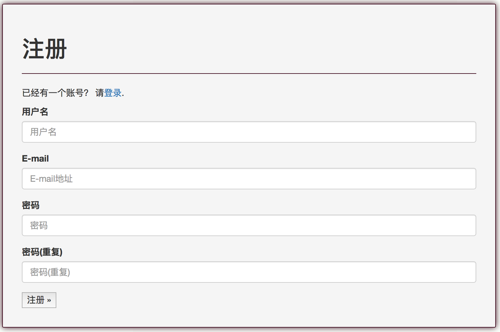
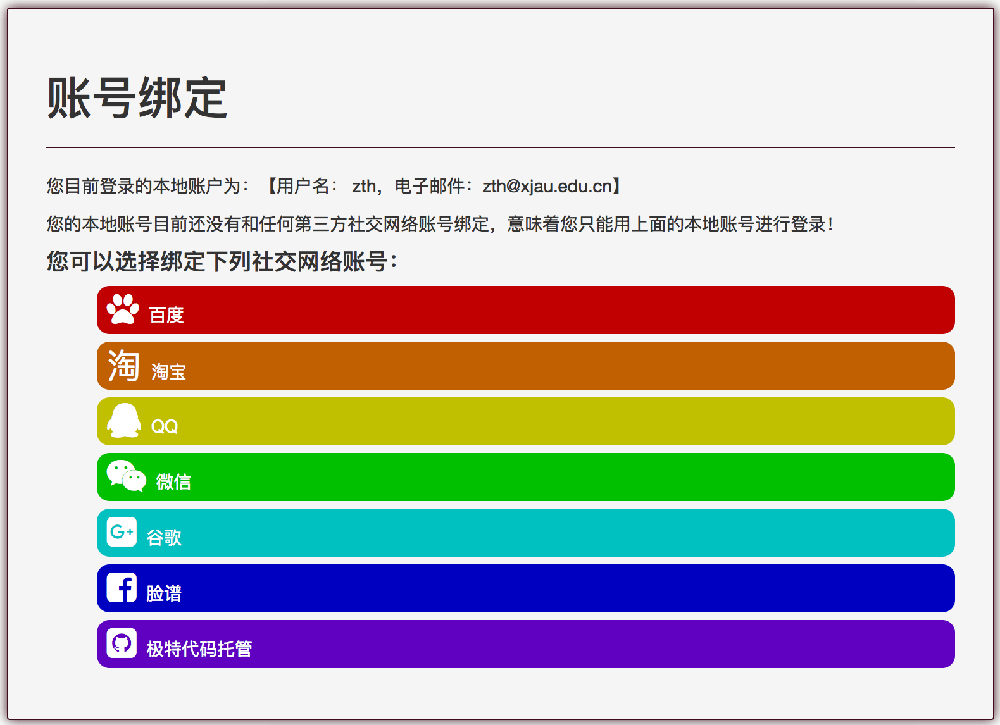
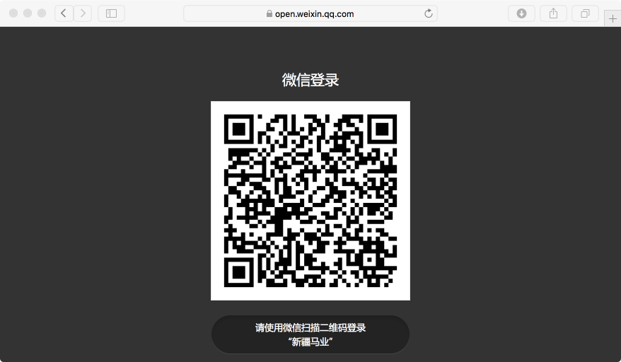
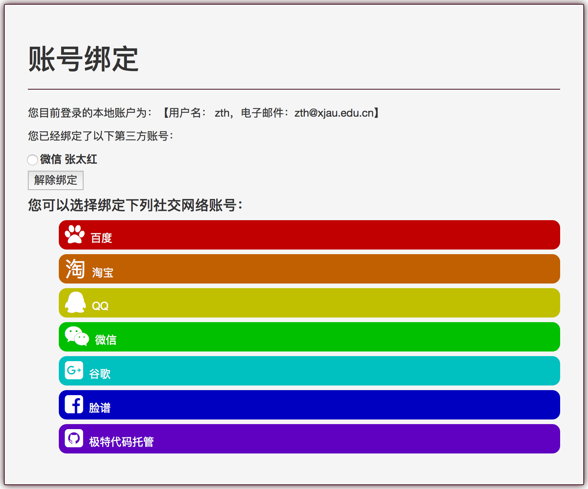

# 新疆马产业科技创新平台《操作手册》
### 一、账户管理
新疆马产业科技创新平台采用统一身份认证、单点登录管理系统所有用户。平台中不受限制的内容不需要登录即可访问，但有些内容的访问、业务操作则要求注册用户获得相应授权后才能进行。
#### 1、用户注册
要在本平台注册一个账号，您必须提供【用户名】和【邮箱地址】，【用户名】不能少于3个英文半角字符、不能多于150个英文半角字符，允许使用英文和中文。【邮箱地址】必须是真实可访问的。平台内【用户名】和【邮箱地址】匀要求唯一性，否则在注册过程中系统将提示"已存在一位使用该名字的用户"或"此e-mail地址已被其他用户注册"。密码不能少于8个字符，且不能全部为数字。
新注册用户会受到一封确认邮件，您必须查收该邮件并点击确认链接进行邮箱确认，只有邮箱确认的账户才能登陆本平台。

要注册一个账户，请在平台首页导航栏点击【登录】，然后选择右上角的【注册】，就会出现下面所示的注册界面：

#### 2、账户绑定
很多人已经在各类网络社交等平台，比如百度、QQ、微信、淘宝上拥有自己的账户，为了减轻用户记忆各类账户和密码的负担，新疆马产业科技创新平台允许通过第三方社交网络认证登录，目前支持的第三方认证登录包括百度、淘宝、QQ、微信、谷歌、脸谱和GitHub（及特代码托管）7家。
要使用第三方社交网络认证登录，您首先要在上述7家平台拥有自己的账户，然后在本平台注册一个账户并进行邮箱确认，接下来登录本平台，在平台首页导航栏点击您的账号（邮箱），在下拉式菜单选择【账户绑定】，会出现以下界面：

通常选择绑定一个您最常用的第三方社交网络账户是比较明智的做法，当然本平台允许您将本地账户和多个第三方社交网络账户绑定。目前QQ、微信、淘宝三家支持手机扫描二维码认证登录，其它四家需通过账号和密码进行登录。三家国外的平台在国内可能无法访问。
在上图中选择点击一个第三方社交网络平台，系统将跳转到它的登录认证界面，假设您打算绑定微信账户，则会跳转到一下界面：

手机扫描验证，然后在手机上点击【确认登录】，会自动从微信登录界面返回到本平台，这就完成了账户绑定，以后您就可以用微信账户直接登录本平台。绑定成功后的界面如下：  
 

 
当然，您也个可以在该界面解除与第三方社交网络账户的绑定。
